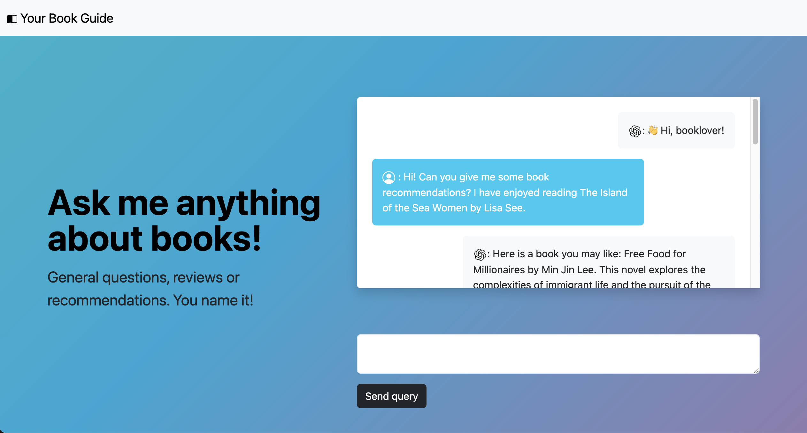

# Chatbot App

## Project Description
This project is a chatbot application designed to provide interactive and automated responses to user queries related to books. The chatbot has an intergrated external New York Times Book API to fetch book reviews. It further can provide book recommendations in a consistent structured output.

The chatbot is built using the Flask framework and OpenAI API, and incorporates request handling, and data storage.

## Features
- Function calling: external APIs and structured output formatting.
- Dynamic query handling
- Interaction history maintenance
- Intent and entity scopes
- In-context learning

## Project Structure
- `app.py` : The main application file where routes and application logic are defined.
- `completions_model.py` : Handles the OpenAI completion model logic for generating responses in the chatbot.
- `forms.py` : Manages the web forms used for user interactions within the chatbot interface.
- `get_book_reviews_from_nyt.py` : Manages interaction with New Yourk Times Book API.
- `requirements.txt` : Lists the dependencies required for the application.
- `static/` : Contains static files like CSS, JavaScript, and images.
- `templates/` : Contains HTML templates for rendering web pages.

## Usage
- Home Page: Main page for the user-chatbot interaction. Submits queries and displays chat history.

## Contributing
Feel free to submit issues and enhancement requests.

